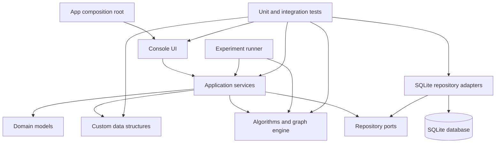

# Project architecture

The architecture is deliberately layered but small enough for a semester project. The console UI never talks directly to SQLite or to individual data-structure classes. Application services coordinate use cases and depend on repository interfaces; SQLite adapters implement those interfaces.



## Dependency rules

1. `model` has no dependency on UI, database, or algorithms.
2. `datastructures`, `graph`, and `algorithms` contain assessed logic and do not import JDBC or console classes.
3. `application.services` orchestrates use cases; it may depend on models, custom structures, algorithms, and repository ports.
4. `application.ports` contains interfaces only. `database.repository` implements them.
5. `ui.console` depends on application services, not database tables or concrete algorithm classes.
6. `experiments` calls public APIs and records results without changing algorithm behavior.
7. `App` is the composition root that creates concrete adapters and wires the layers together.

## Ownership under the current assignment

- Julyn Anim owns `model`, `application`, `database`, repository ports/adapters, and system wiring.
- Papa Kwame owns `ui.console`; the menu calls application services and remains independent of JDBC.
- Maron owns the central `src/test` suite and coordinates the 40+ test target with each implementation owner.
- Naakie owns `experiments` in addition to the assigned graph, Dijkstra, dynamic-programming, and disjoint-set work.
- Ganyo owns `docs/evidence`, including trace tables, proof sketches, and counterexamples.
- Group A and the remaining Group B members own the assessed packages listed in `team-workstreams.md`.

## Folder structure

```text
src/
  main/java/ug/edu/ugmc/optimizer/
    App.java                         # composition root only
    model/                           # Location, Road, ServiceRequest, Resource
    datastructures/
      linear/                        # dynamic array, linked list, iterator
      queues/                        # stack, queue, circular queue, deque
      heap/                          # heap and priority queue
      hashing/                       # hash table and custom set/map
      trees/                         # BST, red-black tree, B-tree
      disjointset/                   # union/find
    graph/                           # graph interfaces, adjacency list/matrix
    algorithms/
      search/
      sort/
      graph/
      optimization/
    application/
      ports/                         # repository interfaces
      services/                      # scheduling, routing, indexing use cases
    database/
      DatabaseManager.java
      repository/                    # SQLite implementations of ports
    ui/
      console/                       # menu, input parsing, result formatting
    experiments/                     # repeatable benchmark runner and CSV export
    tools/                           # deterministic seed generators only
  test/java/ug/edu/ugmc/optimizer/   # mirrors main packages
    integration/                     # cross-layer database/service tests
    support/                         # shared test fixtures and assertions
data/                                # canonical CSV seeds
docs/
  architecture.md
  team-workstreams.md
  evidence/                          # traces, proofs, counterexamples, methods
results/                             # generated locally; ignored until approved
schema.sql                           # authoritative SQLite schema
```

## UI responsibilities

The console menu should expose examiner-focused actions rather than one menu item per Java class:

1. Initialize/reload database.
2. Demonstrate queue and priority scheduling.
3. Search and sort requests/resources.
4. Show reachable locations and shortest route.
5. Show Prim/Kruskal connection networks.
6. Run greedy and dynamic-programming allocation.
7. Run tests or display the latest test summary.
8. Run/export performance experiments.
9. Exit cleanly.

Each action calls an application service and handles invalid input without terminating the program.

## Test architecture

- Unit tests mirror the production package being tested.
- Database tests use a temporary SQLite file and canonical seed data.
- Integration tests exercise services through repository ports and SQLite adapters.
- UI tests pass scripted input and capture output instead of requiring manual typing.
- Benchmarks are separate from unit tests so CI is not dependent on machine speed.
